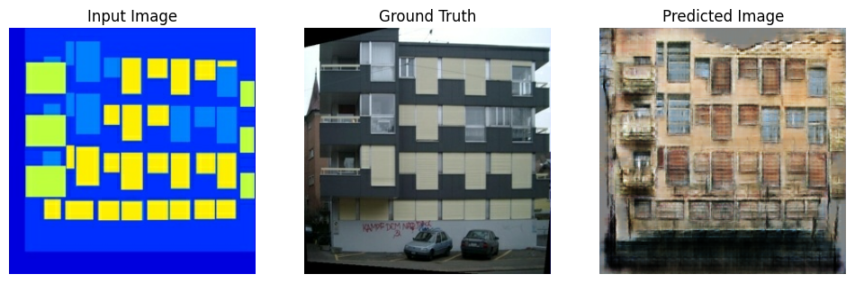

# Sketch2Image GAN
This project aims to create an interactive image generation model that converts sketches into realistic images.
The goal is to design a Pix2Pix-style GAN model, which users can interact with through a web interface.

All the code for the model can be found in the notebook `Sketch2Image.ipynb`.
This notebook includes the complete data pipeline,training procedures and generating Images.

## Deployment
The model is deployed within the `interface.html` file, which serves as the web interface for this application.
You can interact with the model via the [inteface](https://seddik-turki.github.io/Sketch2Image/interface.html).

## Results

