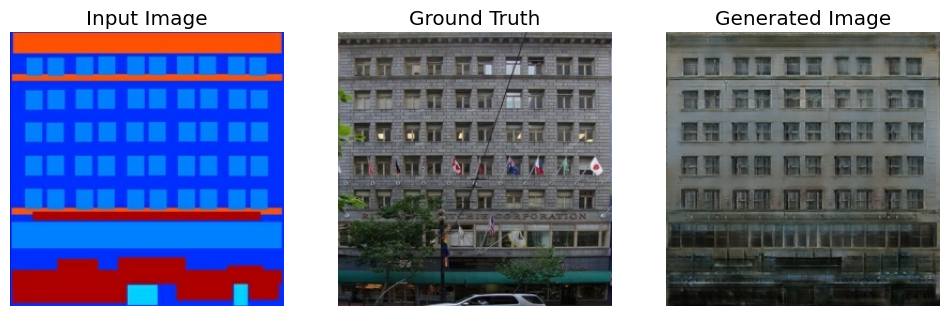

## Facade Generation Project
This project demonstrates how to build and train a conditional generative adversarial network (cGAN) called pix2pix that learns a mapping from input images to output images, as described in [Image-to-image translation with conditional adversarial networks by Isola et al. (2017) ](https://arxiv.org/abs/1611.07004). `pix2pix` can be applied to a wide range of tasks, including synthesizing photos from label maps, generating colorized photos from black and white images, turning Google Maps photos into aerial images, and even transforming sketches into photos.
In this project, the model will generate images of building facades.

Below are some examples of the output generated by the pix2pix cGAN after training for 200 epochs on the facades dataset (116k steps)

The project encompasses the entire process, from model creation and training to deploying a web-based interface that allows for interactive facade design

### Training
The model was trained on kaggle [notebook link](https://www.kaggle.com/code/seddiktrk/sketch2image-gan-generate-images-of-building) and the process involved multiple stages, including data pipeline, model architecture ,loss functions, generation functions and some model analysis.The model was trained for 200 epochs on a `GPU P100` for nearly 3 hours and then the best model was selected at step `104000` for it's generation quality. The generator and discriminator models are hosted on this link [models](https://drive.google.com/drive/folders/1Cp2Mc9G-BfzZKFmSEYnosazE_2VZHX-1?usp=sharing)

### Web-Based Drawing Interface
To make the model accessible and interactive, I developed a web-based interface hosted. This app allows users to create building facades by drawing on a canvas. The app provides various tools to design components such as windows, doors, balconies, and more, which are then used as input for the model.

you can find the full description of the classes in [here](https://cmp.felk.cvut.cz/~tylecr1/facade/CMP_facade_DB_2013.pdf)

**Key Features**
 * Interactive Drawing: Users can draw building facades directly on a canvas using predefined tools.
 * Custom Facade Design: The app supports the creation of facades with different components, including windows, doors, moldings, and balconies.
 * Real-Time Feedback: The app shows a real-time preview of the designed facade, which can be saved and fed into the model.

Here are some examples generated by the model from masks created by the web-interface:

### Inference
The code for inference can be found in the notebook `Inference.ipynb`.
This notebook will guide users through the steps of loading the model, preparing input data, and generating outputs.

